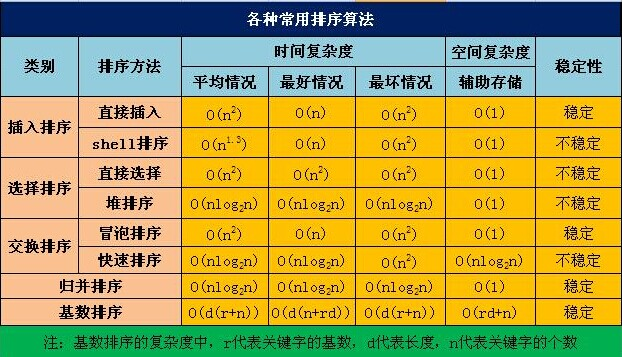
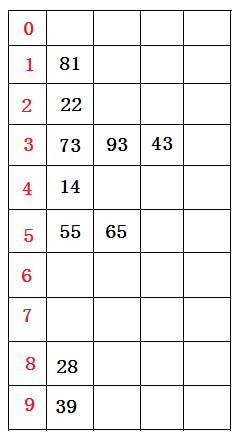
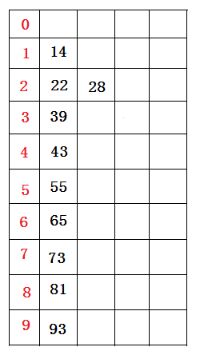

# 各种排序算法的实现和比较
## 算法的稳定性 

​       如果待排序表中有两个元素 Ri 和 Rj，其对应的关键字keyi = keyj，**注意是关键字相等**，且在排序前 Ri 排在 Rj 前面，如果使用某一算法排序后，Ri 仍在 Rj 前面，则称这个算法是稳定的，否则是不稳定的。

​       在排序过程中，根据元素是否完全在内存中，可以将排序算法分为两类：内部排序是指在排序期间元素全部存放在内存中的排序：外部排序是指在排序期间元素无法全部同时放在内存中，必须在排序过程中根据要求不断地在内外存之间移动。 

 

**以下所有代码基于此类结构：**

```c++
typedef int KeyType;
typedef struct
{
    KeyType key;
} DataType;
```

## 1. 插入排序

​        基本思想在于每次将一个待排序的记录，按其关键字大小插入到前面已经排好序的子序列中，直到全部记录插入完成。

### 1.1 直接插入排序

```c
void insertSort(DataType a[], int n)
{
    DataType temp;
    int j = 0;

    for (int i = 1; i < n; i++)     //依次将a[1]~a[n-1]插入到前面已排序的序列
    {
        temp = a[i];               
        for (j = i - 1; temp.key<a[j].key && j>=0; --j) //从后往前查找待插入位置
            a[j + 1] = a[j];                      //向后移位
        a[j + 1] = temp;                          //复制到插入位置     
    }
}
```

​       时间复杂度：O(n2)，空间复杂度O(1)。

​       最好情况，表中所有数据均有序，此时每插入一个元素，都需要比较一次而不移动元素，因而时间复杂度为O(n)。由于每次插入元素时总是从后向前比较，只有新插入的元素小于前面的元素时才会移位，所以相同元素相对位置不会变化，即直接插入排序是一个稳定的排序算法。

### 1.2 希尔排序(缩小增量排序)

​     基本思想：先将待排序表分割成若干形如L[i, i+d, i+2d, ...i+kd]的特殊子表，分别进行直接插入排序，当整个表中元素已呈“基本有序”时，再对全体记录进行一次直接插入排序。希尔排序的排序过程如下：

​        先取一个小于n的步长d1， 把表中全部记录分成的d1个组，所有距离为d1的倍数的记录放在同一个组，在各组中进行直接插入排序，由于此时已经具有较好的局部有序性，故可以很快得到最终结果。尚未求得一个最好的增量序列，希尔提出的方法是d1=n/2, di+1= di/2，并且最后一个增量等于1。

```c
void shellInsert(DataType data[], int len, int dk)
{
    int j;
    DataType temp;
    for (int i = dk; i < len; ++i)
    {
        if (data[i].key < data[i - dk].key)//组内采用直接插入排序
        {
            temp = data[i];
            for (j = i - dk; j>=0 && temp.key<data[j].key; j -= dk)
            {
                data[j + dk] = data[j];
            }
            data[j + dk] = temp;
        }
    }
}

void shellSort(DataType data[], int len, int dlta[], int t) //dlta 为增量数组，t为增量数据大小
{
    for (int k = 0; k<t; ++k)
    {
        shellInsert(data, len, dlta[k]);
    }
}
```

​        空间复杂度为O(1)，由于希尔排序的时间复杂度依赖于增量序列的函数，这涉及数学上尚未解决的难题，所以其时间复杂度分析比较困难，当n在某个特定范围时，希尔排序的时间复杂度约为O(n1.3)。在最坏情况下希尔排序的时间复杂度为O(n2)。当相同关键字的记录被划分到不同子表时，可能会改变他们之间的相对次序，因此，希尔排序是一个不稳定排序方法。

## 2. 交换排序

​    根据序列中两个元素关键字的比较结果来对换这两个记录在序列中的位置。

### 2.1 冒泡排序

​        基本思想：假设待排序表长为n，从后往前（或从前往后）两两比较相邻元素的值，若违反我们的排序规则（即从小到大或从大到小），则交换它们，直到序列比较完。我们称为一趟冒泡，结果最大或者最小的元素交换到待排序列的第一个位置。下一趟第一个位置元素不再参与比较，待排序列减少一个，最多做n-1趟冒泡就能将所有元素排好序。

```c
void bubbleSort(DataType data[], int len)
{
    int flag = 1;    
    DataType temp;

    for (int i = 0; i < len - 1 && flag == 1; ++i) 
    {
        flag = 0;                             c
        for (int j = len - 1; j > i; --j)   //从后往前两两比较相邻元素的值
        {
            if (data[j - 1].key > data[j].key)
            {
                flag = 1;
                temp = data[j-1];
                data[j - 1] = data[j];
                data[j] = temp;
            }
        }
    }
}
```

​       空间复杂度为O(1)，最坏情况下时间复杂度为O(n2)，最好情况下（表中所有元素基本有序）时间复杂度为O(n)， 其平均时间复杂度为O(n2)。它也是一个稳定的冒泡排序算法。

​        冒泡排序中所产生的有序子序列一定是全局有序的（不同于直接插入排序），也就是有序子序列的所有元素的关键字一定小于或大于无序子序列中所有元素的关键字。这样每一趟排序都会将一个元素放置到其最终位置上。

### 2.2 快速排序

​       基本思想：在待排序表中data[1...n]中任取一个元素privot作为基准，通过一趟排序将待排序表划分为独立的两部分L[1..k-1] 和 L[k+1...n],使得L[1...k-1]中所有元素小于等于privot，L[k+1...n]中所有元素大于等于privot，则privot放在其最终位置L(k)上，这个过程称为一趟快速排序。再分别递归地对两个子表重复上述过程，直至每部分内只有一个元素或空为止（所有元素已放在最终位置上）。

 快速排序的分治partition过程有两种方法：

1）两个下标分别从首、尾开始扫描

```c
int partition(DataType data[], int low, int high)
{
    DataType temp = data[low];     //取第一个元素作为基准
 
    while (low < high)
    {
        while (low < high && temp.key <= data[high].key) 
            --high;
        data[low] = data[high];
        
        while (low < high && temp.key >= data[low].key)
            ++low;
        data[high]=data[low];
    }
    
    data[low] = temp;   
    return low;
}
```

2）两个指针索引一前一后逐步向后扫描

```c
int partition(DataType data[], int low, int high)
{
    DataType privot = data[high];       //取最后一位最为基准
    DataType tmp;
    int pos = low - 1;
    
    for (int j = low; j < high; ++j)
    {
        if (privot.key >= data[j].key)
        {
            ++pos;
            tmp = data[pos];
            data[pos] = data[j];
            data[j] = tmp;
        }
    }
    tmp = data[pos + 1];
    data[pos + 1] = data[high];
    data[high] = tmp;
    return pos + 1;
}
```

​        **这种算法有一个特点，即一次划分后，基准左边的元素相对顺序不变，某些应用要求序列的一部分保持相对顺序不变，这时可以考虑此种划分操作。例如**

**初始序列：3 8 7 1 2 5 6 4，一次划分主要步骤如下：**

> > 3和3互换：**3** 8 7 1 2 5 6 4          
>
> > 1和8互换：3 **1** 7 **8** 2 5 6 4
>
> > 2和7互换：3 1 **2** 8 **7** 5 6 4
>
> > 8和4互换：3 1 2 **4** 7 5 6 **8**   

​        划分完成后，3、1、2相对顺序不变。

**quickSort实现：**

```c
void quickSort(DataType data[], int low, int high)
{
    if (low < high)
    {
        int pos = partition(data, low, high);

        if (pos-1 > low)
            quickSort(data, low, pos-1);
        if (pos+1 < high)
            quickSort(data, pos + 1, high);
    }
}
```

​        空间效率：由于快排是递归地需要借助递归工作栈来保存每一层递归调用的必要信息，其容量应与递归调用的最大深度一致。最好情况下为log2(n+1)；最坏情况下，因为进行n-1次递归调用，所以栈的深度为O(n);平均情况下，栈的深度为O(log2n)。因而空间复杂度在最坏情况下为O(n)，平均情况下为O(log2n)。

​        时间效率：快排的运行时间与是否对称有关，而后者又与具体使用的划分算法有关。快速排序的最坏情况发生在两个区域分别包含n-1个元素和0个元素时，最大程度的不对称性若发生在每一层递归上，即对应于初始排序表基本有序或基本逆序时，就得到最坏情况下的时间复杂度为O(n2)。

​        在最理想情况下，也即partition()可能做到最平衡的划分中，得到两个子问题的大小都不可能大于n/2，在这种情况下，快速排序的运行速度将大大提升，此时，时间复杂度为O(nlog2n)。好在快速排序平均情况下运行时间与其最佳情况下的运行时间很接近，而不是解接近其最坏的运行时间。**快排是所有内部排序算法中平均性能最优的排序算法。**

​      快排不是一个稳定的算法。在快排算法中，并不产生有序子序列，但每一趟排序后将一个（基准元素）反倒其最终位置上。快排的优化算法有很多，可以通过1.小范围内使用直接插入排序、2.优化不必要的交换、3.优化递归操作（尾递归）。


```c
void quickSort(DataType data[], int low, int high)
{
    if (low < high)
    {
        while (low < high)
        {
            int pos = partition(data, low, high);
            
            quickSort(data, low, pos-1);
            low = pos + 1;
        }
    }
}
```

## 3. 选择排序

​        基本思想：每一趟在后面n-i+1(i=1,2, ..., n-1)个待排序元素中选取关键字最小的元素，作为有序子序列的第 i 个元素，直到第 n-1 趟做完，待排序元素只剩下 1 个，就不用选了。

### 3.1 简单选择排序 

```c
void selectSort(DataType data[], int len)
{
    DataType temp;
    int min;

    for (int i = 0; i < len - 1; ++i)
    {
        min = i;
        for (int j = i + 1; j < len; ++j)
        {
            if (data[j].key < data[min].key)
                min = j;
        }

        if (min != i)
        {
            temp = data[i];
            data[i] = data[min];
            data[min] = temp;
        }
    }
}
```

​        空间复杂度O(1)。简单选择排序过程中，元素移动的操作次数很少，不会超过3(n-1)次（一次swap需要3次移动），最好的情况是移动0次，此时对应的表已有序；**但元素间比较的次数与序列的初始状态无关，始终是 n(n-1)/2 次**，所以时间复杂度为 O(n2)。

### 3.2 堆排序 

​        基本思想：堆排序是一种属性选择排序方法，它的特点是：在排序过程中，将L[1...n]视为一棵完全二叉树的顺序存储结构，利用完全二叉树中双亲结点和孩子结点之间的内在关系，在当前无序区中选择关键字最大（或最小）元素。

​        堆定义如下：

​               (1) 小根堆： L(i) <= L(2i) 且 L(i) <= L(2i+1) (1 =< i <= n/2)

​               (2) 大根堆： L(i) >= L(2i) 且 L(i) >= L(2i+1) (1 =< i <= n/2)

​        显然，在大根堆中，最大元素存放在根节点内，且对任一非根结点，它的值小于等于其双亲结点值。小根堆的定义刚好相反，根结点是最小元素。

​        创建堆的算法主要有向上调整和向下调整两个，在此不过多描述。

```c
void siftDown(DataType data[], int curIdx, int maxIdx)
{
    int curPos = curIdx, leftIdx = 2 * curPos + 1;
    DataType tmp;

    //从上往下调整
    while (leftIdx <= maxIdx)
    {
        if (leftIdx < maxIdx && data[leftIdx].key < data[leftIdx + 1].key)
            ++leftIdx;

        if (data[leftIdx].key > data[curPos].key)
        {
            tmp = data[leftIdx];
            data[leftIdx] = data[curPos];
            data[curPos] = tmp;

            curPos = leftIdx;
            leftIdx = 2 * curPos + 1;
        }
        else
            break;
    }
}

//创建大根堆
void createHeap(DataType data[], int len)
{
    for (int i = (len/2 - 1); i >= 0; --i)   //从最后一个分支开始调整
        siftDown(data, i, len - 1);
}

void heapSort(DataType data[], int len)
{
    DataType temp;
    int lastIndex = len - 1;

    createHeap(data, len);
    //用最后一个元素取代堆顶元素然后再调整，原堆顶元素放在末尾，即最大元素的放在末尾（从小到大排序）
    while (lastIndex > 0)
    {
        temp = data[0];
        data[0] = data[lastIndex];
        data[lastIndex] = temp;

        --lastIndex;
        siftDown(data, 0, lastIndex);
    }
}
```

​       堆排序向下调整与树高有关，为O(h)，建堆过程中每次向下调整时，大部分结点的高度较小，因此可以证明在元素个数为n的序列上建堆，其时间复杂度为O(n)。

​        堆排序仅使用了常数个辅助单元，所以空间复杂度为O(1)。在最好、最坏和平均情况下，堆排序的时间复杂度为O(nlog2n)。堆排序是一个不稳定的算法。

## 4. 归并排序

### 4.1  二路归并排序 

​       “归并”的含义是将一个或两个以上的有序表组合成一个新的有序表。假定待排序表含有n个记录，则可以视为n个有序的子表，每个子表长度为1，然后两两归并，得到n/2个长度为2或1的有序表；再两两归并，......如此重复，直到合并成一个长度为n的有序表为止，这种排序方法称为二路归并排序。

```c
//将分组两两合并
void merge(DataType data[], int len, DataType result[], int grpLen)
{
    int leftStart = 0, leftEnd = leftStart+grpLen-1, rightStart, rightEnd;
    int index = 0;
    int i = 0, j = 0;

    while (leftEnd < len - 1)
    {
        rightStart = leftStart + grpLen;
        rightEnd = (rightStart + grpLen - 1 >= len - 1) ? len - 1 : rightStart + grpLen - 1;

        for (i = leftStart, j = rightStart; i <= leftEnd && j <= rightEnd;)
        {
            if (data[i].key < data[j].key)
                result[index++] = data[i++];
            else
                result[index++] = data[j++];
        }
        while (i <= leftEnd)
            result[index++] = data[i++];
        while (j <= rightEnd)
            result[index++] = data[j++];    

        leftStart = rightEnd + 1;
        leftEnd = leftStart + grpLen - 1;
    }
    //处理剩余的元素：开始未能加入合并的分组（比如奇数组时，最后一组刚开始不能参加合并）
    for (i = leftStart; i < len; ++i)
        result[index++] = data[i];
}

void mergeSort(DataType data[], int len)
{
    DataType *result = (DataType *)malloc(sizeof(DataType)* len);
    memset(result, 0, sizeof(DataType)*len);

    //grplen从1开始
    for (int grplen = 1; grplen < len; grplen *= 2)
    {
        merge(data, len, result, grplen);
        for (int i = 0; i < len; ++i)
            data[i] = result[i];
    }

    free(result);
    result = NULL;
}
```

​        二路归并排序过程中，merge操作中由于辅助空间需要占用n个单元，但每一趟归并后这些空间就被释放了，所以归并排序的空间复杂度为O(n)。每一趟归并的时间复杂度为O(n)，共需进行log2n趟归并，所以算法的时间复杂度为O(nlog2n)。由于merge操作不会改变相同关键字记录的相对次序，所以二路归并排序是一个稳定排序。

## 5. 基数排序（桶排序）

（1）假设有欲排数据序列如下所示：

73  22  93  43  55  14  28  65  39  81

首先根据个位数的数值，在遍历数据时将它们各自分配到编号0至9的桶（个位数值与桶号一一对应）中。

分配结果（逻辑想象）如下图所示：



分配结束后。接下来将所有桶中所盛数据按照桶号由小到大（桶中由顶至底）依次重新收集串起来，得到如下仍然无序的数据序列：

81  22  73  93  43  14  55  65  28  39

接着，再进行一次分配，这次根据十位数值来分配（原理同上），分配结果（逻辑想象）如下图所示：



分配结束后。接下来再将所有桶中所盛的数据（原理同上）依次重新收集串接起来，得到如下的数据序列：

14  22  28  39  43  55  65  73  81  93

​        此时原无序数据序列已经排序完毕。如果排序的数据序列有三位数以上的数据，则重复进行以上的动作直至最高位数为止。

​        仔细观察上面算法，我们会发现就是先将个位最小放前边，然后将十位最小放前边，自然而然就是一个有小到大的有序序列。

​       基于两种不同的排序顺序，我们将基数排序分为LSD（Least significant digital）或MSD（Most significant digital），LSD的排序方式由数值的最右边（低位）开始，而MSD则相反，由数值的最左边（高位）开始。MSD的方式与LSD相反，是由高位数为基底开始进行分配，但在分配之后并不马上合并回一个数组中，而是在每个“桶子”中建立“子桶”，将每个桶子中的数值按照下一数位的值分配到“子桶”中。在进行完最低位数的分配后再合并回单一的数组中。

注意一点：LSD的基数排序适用于位数少，元素个数多的数列，如果位数多的话，使用MSD的效率会比较好


（2）我们把扑克牌的排序看成由花色和面值两个数据项组成的主关键字排序。

要求如下：

花色顺序：梅花<方块<红心<黑桃

面值顺序：2<3<4<...<10<J<Q<K<A

那么，若要将一副扑克牌排成下列次序：

梅花2，...，梅花A，方块2，...，方块A，红心2，...，红心A，黑桃2，...，黑桃A。

有两种排序方法：

<1>先按花色分成四堆，把各堆收集起来；然后对每堆按面值由小到大排列，再按花色从小到大按堆收叠起来。----称为"最高位优先"(MSD)法。

<2>先按面值由小到大排列成13堆，然后从小到大收集起来；再按花色不同分成四堆，最后顺序收集起来。----称为"最低位优先"(LSD)法。

基数排序算法描述以及MSD算法实现来源：<http://www.cnblogs.com/Braveliu/archive/2013/01/21/2870201.html>

**MSD算法实现：**

最高位优先法通常是一个递归的过程：

> * 先根据最高位关键码K1排序，得到若干对象组，对象组中每个对象都有相同关键码K1。	
> * 再分别对每组中对象根据关键码K2进行排序，按K2值的不同，再分成若干个更小的子组，每个子组中的对象具有相同的K1和K2值。
> * 依此重复，直到对关键码Kd完成排序为止。
> * 最后，把所有子组中的对象依次连接起来，就得到一个有序的对象序列。

```c
int getKey(KeyType value, int k)
{
    int key = -1;
    while (k > 0)
    {
        key = value % 10;
        value /= 10;
        --k;
    }
    return key;
}
void radixSort(DataType data[], int left, int right, int d) //d代表几位数
{
    int count[10] = { 0 };
    int i, j;
    int p1, p2;
    DataType *result = (DataType *)malloc(sizeof(DataType)* (right-left+1));

    if (d <= 0) //位数处理完递归结束
        return;

    for (i = left; i <= right; i++)        //统计桶中元素个数
        count[getKey(data[i].key, d)]++;
    for (j = 1; j < 10; j++)               //找出各个桶中元素安放位置的边界
        count[j] = count[j] + count[j - 1];

    //将待排序数组分配至各个桶中，存于辅助数组result中
    for (int i = left; i <= right; i++)
    {
        j = getKey(data[i].key, d);    //取元素data[i].key的第d位
        result[count[j]-1] = data[i];  //按计算好的位置存放
        count[j]--;                    //计数器减1
    }

    for (i = left, j = 0; i <= right; i++, j++)
        data[i] = result[j]; //从辅助数组写入原数组

    free(result);
    result = NULL;
    for (j = 0; j < 10; j++)    //按桶递归对d-1位处理
    {
        p1 = count[j];          //取桶始端
        p2 = count[j + 1] - 1;  //取桶尾端
        radixSort(data, p1, p2, d-1);
    }
}           
```

**LSD算法实现：**  

​        最低位优先法首先依据最低位关键码Kd对所有对象进行一趟排序，再依据次低位关键码Kd-1对上一趟排序的结果再排序，依次重复，直到依据关键码K1最后一趟排序完成，就可以得到一个有序的序列。使用这种排序方法对每一个关键码进行排序时，不需要再分组，而是整个对象组。 

```c
int getKey(KeyType value, int k)
{
    int key = -1;
    while (k >= 0)
    {
        key = value % 10;
        value /= 10;
        --k;
    }
    return key;
}

void distribute(DataType data[], int len, list<DataType> (&lst)[10], int k)
{
    for (int i = 0; i < 10; ++i)
        lst[i].clear();

    int key;
    for (int j = 0; j < len; ++j)
    {
        key = getKey(data[j].key, k);
        lst[key].push_back(data[j]);
    }
}

void collect(DataType data[], list<DataType> (&lst)[10])
{
    int k = 0;
    for (int i = 0; i < 10; ++i)
    {
        while (!lst[i].empty())
        {
            data[k++] = lst[i].front();
            lst[i].pop_front();
        }
    }
}

void radixSort(DataType data[], int len, int d) //d代表几位数
{
    list<DataType> lst[10];
    for (int i = 0; i < d; ++i)
    {
        distribute(data, len, lst, i);
        collect(data, lst);
    }
}
```

​	设待排序列为n个记录，d个关键码，关键码的取值范围为radix，则进行链式基数排序的时间复杂度为O(d(n+radix))，其中，一趟分配时间复杂度为O(n)，一趟收集时间复杂度为O(radix)，共进行d趟分配和收集。 空间效率：需要2*radix个指向队列的辅助空间，以及用于静态链表的n个指针。基数排序法是属于稳定性的排序，在某些时候，基数排序法的效率高于其它的稳定性排序法。