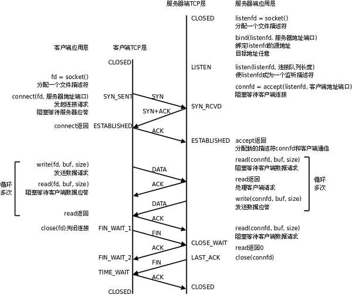

## C/C++基础

### 1. 内存对齐，带来的好处是什么

### 2. 构造函数初始化列表和其他方式有什么区别

无论是在构造函数初始化列表中初始化成员，还是在构造函数体中对它们赋值，最终结果是相同的。不同之处在于，使用构造函数初始化列表的版本表示初始化数据成员，没有定义初始化列表的构造函数版本在构造函数体中对数据成员赋值。

首先把数据成员按类型分类： 
1、内置数据类型，复合类型（指针，引用） 
2、用户定义类型

对于类型1，在成员初始化列表和构造函数体内进行，在性能和结果上都是一样的 
对于类型2，结果上相同，但是性能上存在很大的差别。因为类类型的数据成员对象在进入函数体是已经构造完成，也就是说在成员初始化列表处进行构造对象的工作，这是调用一次构造函数，在进入函数体之后，进行的是对已经构造好的类对象的赋值，又调用个拷贝赋值操作符才能完成（如果并未提供，则使用编译器提供的默认按成员赋值行为）。

### 3. 指针与引用，sizeof(ptr)和sizeof(reference)

**指针和引用的几点差别：**

> * 在任何情况下都不能使用指向空值的引用。但指针可以给他赋空值。
> * 在C＋＋里，引用应被初始化。但指针可以是未初始化的指针（不过空指针合法但危险）。
> * 不存在指向空值的引用这个事实意味着使用引用的代码效率比使用指针的要高。因为在使用引用之前不需要测试它的合法性。相反，指针则应该总是被测试，防止其为空。
> * 指针与引用的另一个重要的不同是指针可以被重新赋值以指向另一个不同的对象。但是引用则总是指向在初始化时被指定的对象，以后不能改变。

总的来说，在以下情况下你应该使用指针，一是你考虑到存在不指向任何对象的可能（在这种情况下，你能够设置指针为空），二是你需要能够在不同的时刻指向不同的对象（在这种情况下，你能改变指针的指向）。如果总是指向一个对象并且一旦指向一个对象后就不会改变指向，那么你应该使用引用。

还有一种情况，就是当你重载某个操作符时，你应该使用引用。最普通的例子是操作符[]。这个操作符典型的用法是返回一个目标对象，其能被赋值。

### 4. C与C++的区别

### 5. 面向对象的特征

### 6. 用C能不能实现多态，怎么实现

### 7. new和malloc的区别和底层原理

### 8. 智能指针

#### 8.1 为什么要引用智能指针

#### 8.2 unique_ptr与auto_ptr

#### 8.3 shared_ptr原理，shared_ptr会造成什么问题，怎么解决

### 9. 多重循环如何提高效率

```
1、实例化变量放在for循环外，减少实例化的次数
2、把能在循环外计算的，尽量在循环外计算，减少在内层的运算，有判断条件的语句和与循环不相关的操作语句尽量放在for外面
3、应当将最长的循环放在最内层，最短的循环放在最外层，以减少CPU跨切循环层的次数
4、将普通变量变为寄存器变量

在程序运行时，根据需要到内存中相应的存储单元中调用，如果一个变量在程序中频繁使用，例如循环变量，那么，系统就必须多次访问内存中的该单元，影响程序的执行效率。因此，C\C++语言定义了一种变量，不是保存在内存上，而是直接存储在CPU中的寄存器中，这种变量称为寄存器变量。
```

### 10. 如果类有虚函数，类的大小，空的类大小

### 11. STL

#### 11.1 vector扩容时机，扩容机制，怎么减少扩容

#### 11.2 deque的底层实现

#### 11.3 说一下push_back和emplace_back的区别

#### 11.4 map和set的底层实现

### 13. 拷贝构造函数什么时候被调用，为什么要传引用

防止递归构造

### 14. 多态的实现原理，怎么知道绑定对象的具体类型

### 15. 什么是右值引用？为什么引进右值引用？好处？与左值引用的区别是什么？

### 16. 类静态变量的初始化

### 17. 虚函数的效率如何

### 18. 重载、重写和覆盖

### 19. C语言如何实现C++对象以及私有成员

### 20. 虚函数指针的初始化过程

### 21. C++11原子变量介绍

### 22. 怎样理解C++中的static关键字

### 23. C++中的内存分配，运行时内存分布

### 24. 析构函数可以是虚函数？为什么

### 25. 深拷贝与浅拷贝

### 26. 指针常量、常量指针的区别

### 27. inline和define的区别

### 28. C语言如何实现多态

### 29. 右值引用、移动语义、完美转发

### 30. 通用引用、引用折叠

### 31. 虚函数的原理，虚表的第一项和第二项

### 32. 菱形继承时，内存布局

## 数据结构和算法

### 1. 红黑树

### 2. B树、B+树、B-树

### 3. hash

#### 3.1 hash处理冲突的解决办法

#### 3.2 

### 4. 数组链表的区别

### 5.redis数据结构用过那些，了解跳表？

### 6. 红黑树比平衡二叉树有那些优点

### 7. AC自动机时间复杂度

### 8. 二分查找及其变种

### 9. 一致性hash

### 10. 常见的负载均衡策略

### 11. 前缀树

### 12. 排序算法时间复杂度


## 网络基础

### 1. 网络编程的模型

### 2. UDP

#### 2.1 udp包长度

#### 2.2 udp实现可靠传输

#### 2.3 udp的接收缓冲区、发送缓冲区和tcp的区别

### 3. HTTP与HTTPS

#### 3.1 HTTP和HTTPS的区别

#### 3.2 是否了解中间人劫持原理

#### 3.3 http协议格式，几种方法，功能是什么


 **1.GET** 请求指定的页面信息，并返回实体主体 

 **2.HEAD** 类似于GET请求，只不过返回的响应体，用于获取报头。 

 **3.POST** 向指定的资源提交数据进行处理请求。数据被包含在请求体中。POST请求可能会导致新的资源的建立或已有资源的修改。 

 **4.PUT** 从[客户端]()向服务端传送的数据取代指定的文档的内容 

 **5.DELETE** 请求服务器删除指定的页面 

 **6.CONNECT** HTTP/1.1协议中预留给能将连接改为管道方式的代理服务器 

 **7.OPTIONS** 允许[客户端]()查看服务端的性能 

 **8.TRACE** 回显服务端收到的请求，主要用于测试或诊断 

 **9.PATCH** 是对PUT方法的补充，用来对已知资源进行局部更新。 

#### 3.4 chunked块了解？介绍下

#### 3.5 有chunked的时候，contentlength是什么样子

#### 3.6 http长连接和短连接的区别

#### 3.7 session和cookie

### 4. TCP

**TCP头部为20字节:** 

```
源端口和目的端口
   各占2个字节，这两个值加上IP首部中的源端IP地址和目的端IP地址唯一确定一个TCP连接。有时一个IP地址和一个端口号也称为socket（插口）。
   
序号(seq)
   占4个字节，是本报文段所发送的数据项目组第一个字节的序号。在TCP传送的数据流中，每一个字节都有一个序号。例如，一报文段的序号为300，而且数据共100字节，则下一个报文段的序号就是400；序号是32bit的无符号数，序号到达2^32-1后从0开始。
   
确认序号(ack)
   占4字节，是期望收到对方下次发送的数据的第一个字节的序号，也就是期望收到的下一个报文段的首部中的序号；确认序号应该是上次已成功收到数据字节序号+1。只有ACK标志为1时，确认序号才有效。
   
数据偏移
   占4比特，表示数据开始的地方离TCP段的起始处有多远。实际上就是TCP段首部的长度。由于首部长度不固定，因此数据偏移字段是必要的。数据偏移以32位为长度单位，也就是4个字节，因此TCP首部的最大长度是60个字节。即偏移最大为15个长度单位=1532位=154字节。保留6比特，供以后应用，现在置为0。

6个标志位比特
URG：当URG=1时，注解此报文应尽快传送，而不要按本来的列队次序来传送。与“紧急指针”字段共同应用，紧急指针指出在本报文段中的紧急数据的最后一个字节的序号，使接管方可以知道紧急数据共有多长。
ACK：只有当ACK=1时，确认序号字段才有效；
PSH：当PSH=1时，接收方应该尽快将本报文段立即传送给其应用层。
通过允
许客户应用程序通知其 TCP设置PUSH标志，客户进程通知TCP在向服务器发送一个报文段时不要因等待额外数据而使已提交数据在缓存中滞留。类似地，当服务器的TCP接收到一个设置了PUSH标志的报文段时，它需要立即将这些数据递交给服务器进程而不能等待判断是否还会有额外的数据到达。
RST：当RST=1时，表示出现连接错误，必须释放连接，然后再重建传输连接。复位比特还用来拒绝一个不法的报文段或拒绝打开一个连接；
SYN：SYN=1,ACK=0时表示请求建立一个连接，携带SYN标志的TCP报文段为同步报文段；
FIN：发端完成发送任务。

窗口
   TCP通过滑动窗口的概念来进行流量控制。设想在发送端发送数据的速度很快而接收端接收速度却很慢的情况下，为了保证数据不丢失，显然需要进行流量控制， 协调好通信双方的工作节奏。所谓滑动窗口，可以理解成接收端所能提供的缓冲区大小。TCP利用一个滑动的窗口来告诉发送端对它所发送的数据能提供多大的缓冲区。窗口大小为字节数起始于确认序号字段指明的值（这个值是接收端正期望接收的字节）。窗口大小是一个16bit字段，因而窗口大小最大为65535字节。

检验和
	检验和覆盖了整个TCP报文段：TCP首部和数据。这是一个强制性的字段，一定是由发端计算和存储，并由收端进行验证。

紧急指针
   只有当URG标志置1时紧急指针才有效。紧急指针是一个正的偏移量，和序号字段中的值相加表示紧急数据最后一个字节的序号。
```




#### 4.1 tcp粘包

#### 4.2 tcp的三次握手，client端如果不会ack会怎么样？

如果最后一次ACK在网络中丢失，那么Server端（服务端）该TCP连接的状态仍为SYN_RECV，并且根据TCP的超时重传机制依次等待3秒、6秒、12秒后重新发送 SYN+ACK 包，以便 Client（客户端]）重新发送ACK包。 

如果重发指定次数后，仍然未收到ACK应答，那么一段时间后，Server（服务端）自动关闭这个连接。 

但是Client（客户端）认为这个连接已经建立，如果Client（客户端）端向Server（服务端）发送数据，Server端（服务端）将以RST包（Reset，标示复位，用于异常的关闭连接）响应，此时，客户端知道第三次握手失败。

#### 4.3. 如果tcp握手大量的发syn会怎样呢

SYN Flood利用TCP协议缺陷，发送大量伪造的TCP连接请求，常用假冒的IP或IP号段发来海量的请求连接的第一个握手包（SYN包），被攻击服务器回应第二个握手包（SYN+ACK包），因为对方是假冒IP，对方永远收不到包且不会回应第三个握手包。导致被攻击服务器保持大量SYN_RECV状态的“半连接”，并且会重试默认5次回应第二个握手包，大量随机的恶意syn占满了未完成连接队列，导致正常合法的syn排不上队列，让正常的业务请求连接不进来。【服务器端的资源分配是在二次握手时分配的，而[客户端]()的资源是在完成三次握手时分配的，所以服务器容易受到SYN洪泛攻击】 

检测 SYN 攻击非常的方便，当你在服务器上看到大量的半连接状态时，特别是源IP地址是随机的，基本上可以断定这是一次SYN攻击【在 Linux/Unix 上可以使用系统自带的 netstats 命令来检测 SYN 攻击】 

怎么解决？  

- 缩短超时（SYN Timeout）时间 
- 增加最大半连接数 
- 过滤网关防护 
- SYN cookies技术： 

1. 当服务器接受到 SYN 报文段时，不直接为该 TCP 分配资源，而只是打开一个半开的套接字。接着会使用 SYN 报文段的源 Id，目的 Id，端口号以及只有服务器自己知道的一个秘密函数生成一个 cookie，并把 cookie 作为序列号响应给客户端。 
2. 如果客户端是正常建立连接，将会返回一个确认字段为 cookie + 1 的报文段。接下来服务器会根据确认报文的源 Id，目的 Id，端口号以及秘密函数计算出一个结果，如果结果的值 + 1 等于确认字段的值，则证明是刚刚请求连接的客户端，这时候才为该 TCP 分配资源。

#### 4.5 讲一下流量控制


#### 4.6 三次握手四次挥手越详细越好

**三次握手：**

为了保证数据能到达目标，TCP采用三次握手策略。

1. 发送端首先发送一个带SYN（synchronize）标志的数据包给接收方【第一次的seq序列号是随机产生的，这样是为了网络安全，如果不是随机产生初始序列号，黑客将会以很容易的方式获取到你与其他主机之间的初始化序列号，并且伪造序列号进行攻击】 
2. 接收端收到后，回传一个带有SYN/ACK（acknowledgement）标志的数据包以示传达确认信息【SYN 是为了告诉发送端，发送方到接收方的通道没问题；ACK 用来验证接收方到发送方的通道没问题】 
3. 最后，发送端再回传一个带ACK标志的数据包，代表握手结束
   若在握手某个过程中某个阶段莫名中断，TCP协议会再次以相同的顺序发送相同的数据包

三次握手的目的是建立可靠的通信信道，说到通讯，简单来说就是数据的发送与接收，而三次握手最主要的目的就是双方确认自己与对方的发送与接收是正常的

1. 第一次握手，发送端：什么都确认不了；接收端：对方发送正常，自己接受正常 
2. 第二次握手，发送端：对方发送，接受正常，自己发送，接受正常 ；接收端：对方发送正常，自己接受正常 
3. 第三次握手，发送端：对方发送，接受正常，自己发送，接受正常；接收端：对方发送，接受正常，自己发送，接受正常

**四次挥手：**

1. 主动断开方（客户端/服务端）-发送一个 FIN，用来关闭主动断开方（客户端/服务端）到被动断开方（客户端/服务端）的数据传送 
2. 被动断开方（客户端/服务端）-收到这个 FIN，它发回一 个 ACK，确认序号为收到的序号加1 。和 SYN 一样，一个 FIN 将占用一个序号 
3. 被动点开方（客户端/服务端）-关闭与主动断开方（客户端/服务端）的连接，发送一个FIN给主动断开方（客户端/服务端） 
4. 主动断开方（客户端/服务端）-发回 ACK 报文确认，并将确认序号设置为收到序号加1 

**为什么连接的时候是三次握手，关闭的时候却是四次握手？**

- 建立连接的时候， 服务器在LISTEN状态下，收到建立连接请求的SYN报文后，把ACK和SYN放在一个报文里发送给客户端。 
- 关闭连接时，服务器收到对方的FIN报文时，仅仅表示对方不再发送数据了但是还能接收数据，而自己也未必全部数据都发送给对方了,所以服务器可以立即关闭，也可以发送一些数据给对方后，再发送FIN报文给对方来表示同意现在关闭连接。因此，服务器ACK和FIN一般都会分开发送，从而导致多了一次

#### 4.7 accept发生在三次握手哪个阶段

客户端ACK，established

#### 4.8 SYN如果丢了，重传多少次

默认5次，tcp_syn_retries 

#### 4.9 seq为1000， 发送了1000个数据，下一个seq是多少

假设对方接收到数据，比如sequence number = 1000，TCP Payload = 1000，数据第一个字节编号为1000，最后一个为1999，回应一个确认报文，确认号为2000，意味着编号2000前的字节接收完成，准备接收编号为2000及更多的数据 。

确认收到的序列，并且告诉发送端下一次发送的序列号从哪里开始（便于接收方对数据排序，便于选择重传）

#### 4.10 讲一下拥塞控制

慢启动、快重传、拥塞避免

#### 4.11 半连接在哪个阶段

三次握手SYN_RECV状态

#### 4.12 tcp可靠性体现在哪里

#### 4.13 为什么TCP挥手每两次中间有一个 FIN-WAIT2等待时间？

主动关闭的一端调用完close以后（即发FIN给被动关闭的一端， 并且收到其对FIN的确认ACK）则进入FIN_WAIT_2状态。如果这个时候因为网络突然断掉、被动关闭的一段宕机等原因，导致主动关闭的一端不能收到被动关闭的一端发来的FIN（防止对端不发送关闭连接的FIN包给本端），这个时候就需要FIN_WAIT_2定时器， 如果在该定时器超时的时候，还是没收到被动关闭一端发来的FIN，那么直接释放这个链接，进入CLOSE状态

#### 4.14 为什么客户端最后还要等待2MSL？为什么还有个TIME-WAIT的时间等待？
1. 保证客户端发送的最后一个ACK报文能够到达服务器，因为这个ACK报文可能丢失，服务器已经发送了FIN+ACK报文，请求断开，客户端却没有回应，于是服务器又会重新发送一次，而客户端就能在这个2MSL时间段内收到这个重传的报文，接着给出回应报文，并且会重启2MSL计时器。 
2. 防止类似与“三次握手”中提到了的“已经失效的连接请求报文段”出现在本连接中。客户端发送完最后一个确认报文后，在这个2MSL时间中，就可以使本连接持续的时间内所产生的所有报文段都从网络中消失，这样新的连接中不会出现旧连接的请求报文。 
3. 2MSL，最大报文生存时间，一个MSL 30 秒，2MSL = 60s

#### 4.15 客户端TIME-WAIT 状态过多会产生什么后果？怎样处理？
1. 作为服务器，短时间内关闭了大量的Client连接，就会造成服务器上出现大量的TIME_WAIT连接，占据大量的tuple /tApl/ ，严重消耗着服务器的资源，此时部分客户端就会显示连接不上。 
2. 作为客户端，短时间内大量的短连接，会大量消耗的Client机器的端口，毕竟端口只有65535个，端口被耗尽了，后续就无法在发起新的连接了 

- 在高并发短连接的TCP服务器上，当服务器处理完请求后立刻主动正常关闭连接。这个场景下会出现大量socket处于TIME_WAIT状态。如果客户端的并发量持续很高，此时部分客户端就会显示连接不上
  - **高并发可以让服务器在短时间范围内同时占用大量端口**，而端口有个0~65535的范围，并不是很多，刨除系统和其他服务要用的，剩下的就更少了 
  - **短连接表示“业务处理+传输数据的时间 远远小于 TIMEWAIT超时的时间”的连接** 
- 解决方法：  
  - 用负载均衡来抗这些高并发的短请求； 
  - 服务器可以设置 SO_REUSEADDR 套接字选项来避免 TIME_WAIT状态，TIME_WAIT 状态可以通过优化服务器参数得到解决，因为发生TIME_WAIT的情况是服务器自己可控的，要么就是对方连接的异常，要么就是自己没有迅速回收资源，总之不是由于自己程序错误导致的 
  - 强制关闭，发送 RST 包越过TIMEWAIT状态，直接进入CLOSED状态

#### 4.16 服务器出现了大量 CLOSE_WAIT 状态如何解决？
大量 CLOSE_WAIT 表示程序出现了问题，对方的 socket 已经关闭连接，而我方忙于读或写没有及时关闭连接，需要检查代码，特别是释放资源的代码，或者是处理请求的线程配置。

#### 4.17 服务端会有一个TIME_WAIT状态吗？如果是服务端主动断开连接呢？
- 发起链接的主动方基本都是客户端，但是**断开连接的主动方服务器和客户端都可以充当**，也就是说，只要是主动断开连接的，就会有 TIME_WAIT状态 。
- 四次挥手是指断开一个TCP连接时，需要客户端和服务端总共发送4个包以确认连接的断开。在socket编程中，这一过程由客户端或服务端任一方执行close来触发 。
- 由于TCP连接时全双工的，因此，每个方向的数据传输通道都必须要单独进行关闭。

#### 4.18 nagle算法

该算法要求一个 TCP连接上最多只能有一个未被确认的未完成的小分组，在该分组的确认到达之前不能发送其他的小分组。相反， TCP收集这些少量的分组，并在确认到来时以一个分组的方式发出去。该算法的优越之处在于它是自适应的：确认到达得越快，数据也就发送得越快。而在希望减少微小分组数目的低速广域网上，则会发送更少的分组。

***小分组的含义***

```

```

#### 4.19 经受时延的确认

通常TCP在接收到数据时并不立即发送ACK；相反，它推迟发送，以便将 ACK与需要沿该方向发送的数据一起发送（有时称这种现象为数据捎带 ACK）。绝大多数实现采用的时延为 200 ms （现在好像是40ms），也就是说，TCP将以最大200 ms的时延等待是否有数据一起发送。

### 5. 介绍下proactor和reactor

### 6. reactor的组成

### 7. IP为什么要分片

### 8. IO复用 

#### 8.1 select什么时候返回0，select和poll的区别

#### 8.2 epoll可读情况有哪些

#### 8.3 10. epoll中的ET和LT模式

#### 8.4 epoll的实现原理

### 11. 什么是零拷贝

### 12. libevent结构，内部实现

### 13. ARP协议工作流程

### 14. 一次url访问会经历那些过程

### 15. 数据包乱序会处理吗

### 16. 

### 17. 


## 操作系统

### 1. 线程和进程的区别，应用场景

### 2. 线程栈和进程栈的区别

### 3. 进程内存的划分，分别存放那些内容

### 4. 自旋锁和互斥锁，怎么实现

### 5. 进程切换和线程切换分别有什么开销呢

### 6. 操作系统的写时拷贝

### 7. LRU怎么实现的

### 8. 动态库和静态库

### 9. volatile和原子变量的区别

### 10. proc文件系统

### 11. 虚拟内存

### 12. 栈内存为什么由系统自动分配和释放

### 13. 守护进程如何创建

### 14. 进程间通信方式，应用场景

### 15. 死锁条件和解除

### 16. 进程调度方式

### 17. 对编译链接的理解

### 18. 共享内存实现原理

### 19. 僵尸进程是什么如何处理，孤儿进程呢？

 **孤儿进程：** 如果一个父进程先于子进程结束，子进程就会成为一个孤儿进程，它由init/systemd进程(现在系统有所更新，一号进程有的已经不再init进程而是systemd进程)收养，成为init进程的子进程。

**僵尸进程：** 如果一个子进程先于父进程终止，而父进程又没有调用wait函数等待子进程结束，子进程会进入僵死状态，即变为一个僵尸进程，并且会一直保持下去除非系统重启。子进程处于僵死状态时，内核只保存该进程的一些必要信息以备父进程所需。此时进程程始终占用资源，同时也减少了系统可以创建的最大进程数。

### 20. 自旋锁在单cpu和多cpu下的使用

### 21. 用户态和内核态

### 22. 进程间通信及原理

### 23. 怎么设计一个线程池

### 24. 死锁

### 25. 中断

### 26. CPU调度方式

### 27. 线程同步的方式及优缺点

### 28. 进程间通信的方式及优缺点

### 29. 内存管理

### 30. 多线程中，一个线程可能生成单例，其他线程有没有可能在其他单例还没有构造好的情况下使用单例，如果有怎么处理？

### 31. 程序局部性原理

顺序执行的指令和线性结构的数据(如数组)，它们通常被限定在某一连续区域。一旦某一位置被访问后，那么它附近的位置很快也会被访问。  

### 32. 内存页大小和进程栈、线程栈的大小怎么查看

## 设计模式

### 1. 基本原则

### 2. 单例模式

### 3. 工厂模式

### 4. 职责链模式

### 5. 代理模式


## 数据库

### 1. 隔离级别及未解决的问题

### 2. Serializable带来了别的什么问题

### 3. 实际应用中使用哪个级别

read committed？

### 4. Redis

#### 4.1 Redis一般可以干啥用

#### 4.2 缓存常见的问题，缓存穿透该怎么办

#### 4.3 分布式锁是怎么做的，不要说插件的处理，讲讲原生[redis](https://www.nowcoder.com/jump/super-jump/word?word=redis)操作

#### 4.4 Redis的hash字典数据结构是啥样的

#### 4.5 Redis主从同步靠什么

#### 4.6 讲讲RDB和AOF吧，AOF怎么保证数据处理的没问题？如果同步的时候挂了丢了数据咋办？

#### 4.7 Redis过期策略是咋样的？惰性和定期删分别有啥优缺点？


### 5. Mysql

#### 5.1 Mysql索引底层啥数据结构（B+树），为啥没用[红黑树](https://www.nowcoder.com/jump/super-jump/word?word=红黑树)

#### 5.2 Mysql性能如何，读写瓶颈是怎样的？缓存呢？

#### 5.3 Mysql常用的优化是怎样的？

#### 5.4 讲讲你见过什么情况索引设了但没用到

#### 5.5 讲讲Mysql分表吧，常用分表有哪些

#### 5.6 Mysql主从同步靠什么？

#### 5.7 如何提高查询速度，加了索引就快了？

#### 5.8 数据库索引底层结构

#### 5.9 mysql与memcache的区别

#### 5.10 mysql常见的三种存储引擎

#### 5.11 mysql B+树索引和hash索引的区别

#### 5.12 mysql常见查询优化方案

### 6. 非关系型数据库和关系型数据库区别，优势比较


## 分布式

### 1. CAP理论

### 2. Zookeeper

#### 2.1 ZAB协议

## 其他专题

### Linux专题

#### 1.  如何查看进程打开的文件

#### 2. 介绍下nm和ldd命令

#### 3. shell命令查内存，端口，io访问量，读写速率

#### 4. awk grep 具体应用

#### 5. 硬链接和软链接，目录可不可以用硬链接

#### 6. 常见命令 netstat iptable tcpdump top

#### 7. makefile介绍下（cmake介绍下）

#### 8. gdb查看堆栈中所有遍历

#### 9. gdb查看shared_ptr

#### 10. gdb如何调试多进程多线程

#### 11. g++和gcc编译出来有什么区别

#### 12. 死锁怎么调试

#### 13. core文件是什么，gdb调试core文件

#### 14. 如何读取一个10G文件，cat一个10g文件会发生什么 

### 手撕代码

#### 1. 链表有无环判断

#### 2. 给一个字符串判断单词数

#### 3. 开方算法

#### 4. 青蛙跳台阶

#### 5. 常用排序

#### 6. 反转链表

#### 7. 两个链表寻找公共节点

#### 8. 查找字符串中不重复的最长子串

#### 9. LRU

#### 10. 求树的深度代码

#### 11. 生产者消费者

#### 12. 编写string类

#### 13. 两个数组A有的B都有，求B-A

#### 14 . 输入一个字符串，输出全排列

#### 15. 统计完全二叉树有多少个节点

#### 16. memcpy实现

### 场景题

#### 1. 设计定时对url进行爬虫

#### 2. 设计服务器实现对爬虫的url进行去重，如何让多个服务器对一个url爬虫指定次数

#### 3. 好多小文件，设计一个服务器来如何存储

#### 4. 设计两地高效传输文件