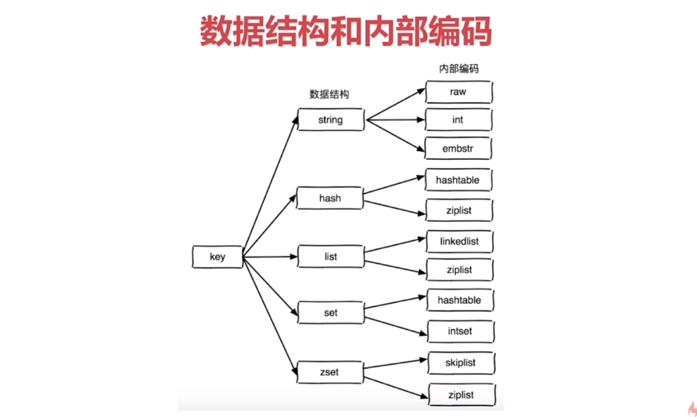
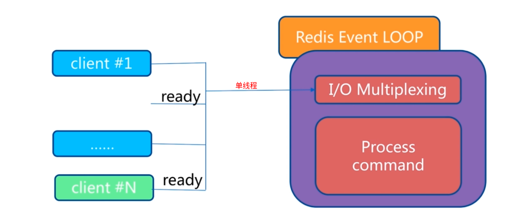

# Redis手册

## 1.Redis初识

## 2. API的理解和使用

### 2.1 通用命令

**keys [pattern]**	

遍历符合pattern的key

```bash
# 遍历所有key
keys  * 
# 遍历以hel开头的key
keys  hel*
# 以he开头,第三个字母是h-l中的一个 
keys  he[h-l]*
```

keys一般不在生产环境使用.一般生产环境键值对多,keys命令时间复杂度为O(n),使用scan替代.

**dbsize**

计算key的总数 , O(1).

**exists [key]**

检查key是否存在, O(1).

**del [key1...]**

删除制定key-value, O(1).

**set [Key value]      mset [key1 value1 ...]**

设置K-V

**expire [key] [seconds]**

设置key的过期时间,O(1).

**ttl [key]**

查看具体过期还有多长时间, 返回值-2代表key已不存在,-1代表key存在但没有过期时间.

**persist [key]**

去掉key的过期时间

**type [key]**

返回key对应的value的类型, 返回none代表key不存在,O(1).


### 2.2 数据结构和内部编码




### 2.3 单线程



> * 一次只运行一条命令
> * 拒绝使用长(慢)命令,如keys,flushall,flushdb,show lua script,mutil/exec,operate big value(collection).
> * 某些情况不是单线程,如fsync file descriptor,close file descriptor.

### 2.4 类型接口

#### string

| 命令                                           | 含义                                                         | 复杂度 |
| :--------------------------------------------- | ------------------------------------------------------------ | :----- |
| set [key] [value]                              | 设置key-value                                                | O(1)   |
| get/del [key]                                  | 获取key对应的value/删除key-value                             | O(1)   |
| mget [k1] [k2].../mset [k1] [v1] [k2] [v2] ... | 批量操作KV                                                   | O(n)   |
| setnx [key] [value]                            | key不存在时设置KV                                            | O(1)   |
| set [key] [value] xx                           | key存在时,才更新KV                                           | O(1)   |
| incr/decr [key]                                | 计数(+1/-1),若key不存在,自增或自减后get key=1/-1             | O(1)   |
| incrby/decrby [key] [step]                     | 计数(+step/-step),如果key不存在,自增或自减后get key=step/-step | O(1)   |
| getset [key] [new value]                       | set [key] [new value] 并返回旧value                          | O(1)   |
| append [key] [value]                           | set [key] [old value + value]     拼接                       | O(1)   |
| strlen [key]                                   | 返回key对应的value的长度,注意中文(一个字可能3个字节)         | O(1)   |
| incrbyfloat [key] [step]                       | 计数(+step),如果key不存在,自增或自减后get key=step           | O(1)   |
| getrange [key] [start] [end]                   | 获取字符串指定下标所有的值,类似取子串                        | O(1)   |
| setrange [key] [index] [value]                 | 设置指定下标所对应的值                                       | O(1)   |

​		设置多个KV串时,使用set/get操作时,客户端多次会发送请求,消耗的时间为n次网络延时+n次命令执行时间, mget/mset相对来说会好很多,消耗的时间为1次网络延时+n次命令执行时间.

#### hash

| 命令                                                         | 含义                                 | 复杂度 |
| :----------------------------------------------------------- | ------------------------------------ | ------ |
| hget [key] [field]/hgetall [key]                             | 获取hash key对应的field的value       | O(1)   |
| hset [key] [field]                                           | 设置hash key对应的field的value       | O(1)   |
| hdel [key] [field]                                           | 删除hash key对应的field和value       | O(1)   |
| hexists [key] [field]                                        | 判断hash key是否存在field字段        | O(1)   |
| hlen [key]                                                   | 获取hash key field的数量             | O(1)   |
| hmget [key] [f1] [f2]... /hmset [key] [f1] [v1] [f2] [v2]... | 批量操作hash                         | O(n)   |
| hincrby [key] [f1] [count]                                   | 设置f1对应的字段递增count            | O(1)   |
| hgetall [key]                                                | 返回hash key对应的所有的field和value | O(n)   |
| hvals [key]                                                  | 返回hash key对应的所有field的value   | O(n)   |
| hkeys [key]                                                  | 返回hash key 对应的所有field         | O(n)   |
| hsetnx [key] [f] [v]                                         | 如果f已存在,则失败                   | O(1)   |
| hincrbyfloat                                                 | hincrby浮点数版本                    | O(1)   |

#### list

> * 有序
> * 可重复

| 命令                                         | 含义                                                         | 复杂度    |
| :------------------------------------------- | ------------------------------------------------------------ | --------- |
| rpush [key] [v1] [v2]...[vn]                 | 从列表右边插入值                                             | O(1)~O(n) |
| lpush [key] [v1] [v2]...[vn]                 | 从列表左边插入值                                             | O(1)~(On) |
| linsert [key] [before\|after] value newvalue | 在list指定的值前\|后插入newvalue                             | O(n)      |
| lpop [key]                                   | 从列表左侧弹出一个item                                       | O(1)      |
| rpop [key]                                   | 从列表右侧弹出一个item                                       | O(1)      |
| lrem [key] [count] [value]                   | 根据count值从列表中删除所有value相等的项：（1）count>0：从左到右，删除最多count个value相等的项；（2）count<0，从右到左删除最多Math.abs(count)个value相等的项；（3）count=0,删除所有value相等的项 | O(n)      |
| ltrim [key] [start] [end]                    | 按照索引范围修剪列表，即保留列表[start, end]，其他删除       | O(n)      |
| lrange key [start] [end]                     | 获取列表指定索引范围[start, end]的所有item.如lrange key 0 2，lrange key 1 -1 | O(n)      |
| lindex [key] [index]                         | 获取列表指定索引的item                                       | O(n)      |
| llen [key]                                   | 获取列表长度                                                 | O(1)      |
| lset [key] [index] [newvalue]                | 设置列表指定索引对应的值为newvalue                           | O(n)      |
| blpop [key] [timeout]                        | lpop阻塞版本，timeout是阻塞超时时间，timeout=0一直等待，直到有值插入 | O(1)      |
| brpop [key] [timeout]                        | rpop阻塞版本，timeout是阻塞超时时间，timeout=0一直等待，直到有值插入 | O(1)      |

注意列表可以反向操作：


**TIPS**


#### set

> * 不能插入重复元素
> * 无序
> * 集合间操作

| 命令                                 | 含义                                               | 复杂度 |
| :----------------------------------- | -------------------------------------------------- | ------ |
| sadd [key] [element]                 | 向集合中添加element(如果element已存在，则添加失败) | O(1)   |
| srem [key] [element]                 | 将集合key中的element移除                           | O(1)   |
| scard [key]                          | 计算集合key的大小                                  | O(1)   |
| sismember [key] [it]                 | 判断it是否在集合key中                              | O(1)   |
| srandmember [key] [count]            | 随机取出集合key中的count个元素，不会删除集合数据   | O( )   |
| smembers [key]                       | 取出集合中所有元素，结果无序                       | O(n)   |
| spop [key]                           | 从集合中随机弹出一个元素，会删除集合数据           | O()    |
| sscan                                |                                                    |        |
| sdiff [key1] [key2]                  | 差集                                               |        |
| sinter [key1] [key2]                 | 交集                                               |        |
| sunion [key1] [key2]                 | 并集                                               |        |
| sdiff\|sinter\|suion + store destkey | 将差集、交集、并集结果保存于destkey中              |        |

**TIPS**


#### zset

> * 有序
> * 不能重复
> * element + score

| 命令                                                     | 含义                                      | 复杂度      |
| :------------------------------------------------------- | ----------------------------------------- | ----------- |
| zadd [key] [score] [element] [score2] [element2]...      | 添加score和element                        | O(log(n))   |
| zrem [key] [element] [element2]...                       | 删除元素                                  | O(1)        |
| zscore [key] [element]                                   | 获取元素的分数                            | O(1)        |
| zincrby [key] [increScore] [element]                     | 增加或减少元素的分数                      | O(1)        |
| zcard [key]                                              | 返回元素的总个数                          | O(1)        |
| zrank [key] [element]                                    | 获取element的排名，从低到高               |             |
| zrange [key] [start] [end] 【withscores】                | 获取指定范围的element并打印分数值（升序） | O(log(n)+m) |
| zrangebyscore [key] [minScore] [maxScore] 【withscores】 | 返回指定分数范围内的升序元素[升序]        | O(log(n)+m) |
| zcount [key] [minScore] [maxScore]                       | 返回有序集合内在指定分数范围内的个数      | O(log(n)+m) |
| zremrangebyrank [key] [start] [end]                      | 删除指定排名内的升序元素                  | O(log(n)+m) |
| zremrangebysocre [key] [minScore] [maxScore]             | 删除指定分数内的升序元素                  | O(log(n)+m) |
| zrevrank                                                 | 与zrank相反                               |             |
| zrevrange                                                | 与zrange相反                              |             |
| zrevrangebyscore                                         | 与zrangebyscore相反                       |             |
| zinterstore                                              | 求交集并保存                              |             |
| zunionstore                                              | 求并集并保存                              |             |


### 2.5 实战

#### 2.5.1 记录网站用户个人主页的访问量

以userid:pageview为key做计数器

```bash
incr userid:pageview    (单线程无竞争)
hincrby userid:1:info pageview 1
```

#### 2.5.2 缓存信息

伪代码:

```java
// string
public VideoInfo get(long id) {
    String redisKey = redisPrefix + id;
    //先从redis查询
    VideoInfo videoInfo = redis.get(redisKey);
    
    if (videoInfo == null) {
        //redis中没有再从原数据源中获取
        videoInfo = mysql.get(id);
        if (videoInfo != null) {
            //获取到之后先序列化后存入redis中
            redis.set(redisKey, serialize(videoInfo));
        }
    }
    
    return videoInfo;
}

// hash
public VideoInfo get(long id) {
    String redisKey = redisPrefix + id;
    Map<String, String> hashMap = redis.hgetAll(redisKey);
    VideoInfo videoInfo = transferMapToVideoInfo(hashMap);
    
    if (videoInfo == null)
    {
        videoInfo = mysql.get(id);
        if (videoInfo != null)
        {
            redis.hmset(redisKey, transferVideoToMap(videoInfo));
        }
    }
}
```

#### 2.5.3 分布式id生成器

与2.5.1类似,利用redis单线程无竞争,能保证incr id是原子操作.  