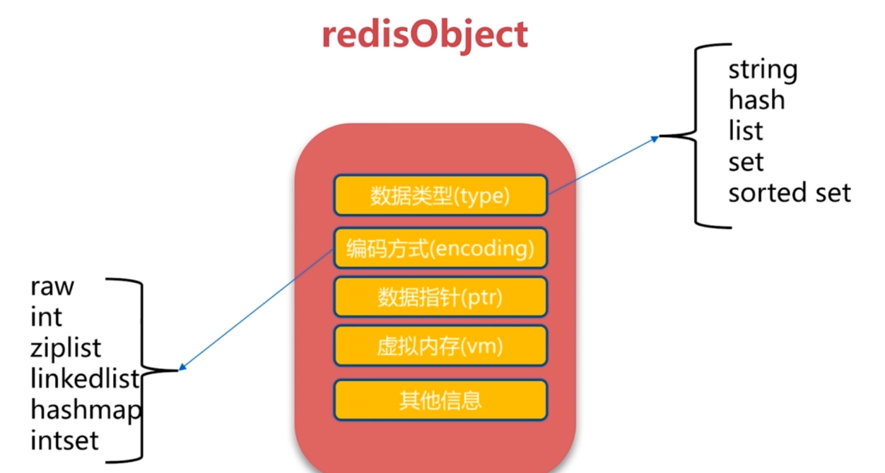

# Redis手册

## 1.Redis初识

## 2. API的理解和使用

### 2.1 通用命令

**keys [pattern]**	

遍历符合pattern的key

```bash
# 遍历所有key
keys  * 
# 遍历以hel开头的key
keys  hel*
# 以he开头,第三个字母是h-l中的一个 
keys  he[h-l]*
```

keys一般不在生产环境使用.一般生产环境键值对多,keys命令时间复杂度为O(n),使用scan替代.

**dbsize**

计算key的总数 , O(1).

**exists [key]**

检查key是否存在, O(1).

**del [key1...]**

删除制定key-value, O(1).

**set [Key value]      mset [key1 value1 ...]**

设置K-V

**expire [key] [seconds]**

设置key的过期时间,O(1).

**ttl [key]**

查看具体过期还有多长时间, 返回值-2代表key已不存在,-1代表key存在但没有过期时间.

**persist [key]**

去掉key的过期时间

**type [key]**

返回key对应的value的类型, 返回none代表key不存在,O(1).


### 2.2 数据结构和内部编码





### 2.3 单线程


> * 一次只运行一条命令
> * 拒绝使用长(慢)命令,如keys,flushall,flushdb,show lua script,mutil/exec,operate big value(collection).
> * 某些情况不是单线程,如fsync file descriptor,close file descriptor.

### 2.4 类型接口

#### string

| 命令                                           | 含义                                                         | 复杂度 |
| :--------------------------------------------- | ------------------------------------------------------------ | :----- |
| set [key] [value]                              | 设置key-value                                                | O(1)   |
| get/del [key]                                  | 获取key对应的value/删除key-value                             | O(1)   |
| mget [k1] [k2].../mset [k1] [v1] [k2] [v2] ... | 批量操作KV                                                   | O(n)   |
| setnx [key] [value]                            | key不存在时设置KV                                            | O(1)   |
| set [key] [value] xx                           | key存在时,才更新KV                                           | O(1)   |
| incr/decr [key]                                | 计数(+1/-1),若key不存在,自增或自减后get key=1/-1             | O(1)   |
| incrby/decrby [key] [step]                     | 计数(+step/-step),如果key不存在,自增或自减后get key=step/-step | O(1)   |
| getset [key] [new value]                       | set [key] [new value] 并返回旧value                          | O(1)   |
| append [key] [value]                           | set [key] [old value + value]     拼接                       | O(1)   |
| strlen [key]                                   | 返回key对应的value的长度,注意中文(一个字可能3个字节)         | O(1)   |
| incrbyfloat [key] [step]                       | 计数(+step),如果key不存在,自增或自减后get key=step           | O(1)   |
| getrange [key] [start] [end]                   | 获取字符串指定下标所有的值,类似取子串                        | O(1)   |
| setrange [key] [index] [value]                 | 设置指定下标所对应的值                                       | O(1)   |

​		设置多个KV串时,使用set/get操作时,客户端多次会发送请求,消耗的时间为n次网络延时+n次命令执行时间, mget/mset相对来说会好很多,消耗的时间为1次网络延时+n次命令执行时间.

#### hash

| 命令                                                         | 含义                                 | 复杂度 |
| :----------------------------------------------------------- | ------------------------------------ | ------ |
| hget [key] [field]/hgetall [key]                             | 获取hash key对应的field的value       | O(1)   |
| hset [key] [field]                                           | 设置hash key对应的field的value       | O(1)   |
| hdel [key] [field]                                           | 删除hash key对应的field和value       | O(1)   |
| hexists [key] [field]                                        | 判断hash key是否存在field字段        | O(1)   |
| hlen [key]                                                   | 获取hash key field的数量             | O(1)   |
| hmget [key] [f1] [f2]... /hmset [key] [f1] [v1] [f2] [v2]... | 批量操作hash                         | O(n)   |
| hincrby [key] [f1] [count]                                   | 设置f1对应的字段递增count            | O(1)   |
| hgetall [key]                                                | 返回hash key对应的所有的field和value | O(n)   |
| hvals [key]                                                  | 返回hash key对应的所有field的value   | O(n)   |
| hkeys [key]                                                  | 返回hash key 对应的所有field         | O(n)   |
| hsetnx [key] [f] [v]                                         | 如果f已存在,则失败                   | O(1)   |
| hincrbyfloat                                                 | hincrby浮点数版本                    | O(1)   |


### 2.5 实战

#### 2.5.1 记录网站用户个人主页的访问量

以userid:pageview为key做计数器

```bash
incr userid:pageview    (单线程无竞争)
hincrby userid:1:info pageview 1
```

#### 2.5.2 缓存信息

伪代码:

```java
// string
public VideoInfo get(long id) {
    String redisKey = redisPrefix + id;
    //先从redis查询
    VideoInfo videoInfo = redis.get(redisKey);
    
    if (videoInfo == null) {
        //redis中没有再从原数据源中获取
        videoInfo = mysql.get(id);
        if (videoInfo != null) {
            //获取到之后先序列化后存入redis中
            redis.set(redisKey, serialize(videoInfo));
        }
    }
    
    return videoInfo;
}

// hash
public VideoInfo get(long id) {
    String redisKey = redisPrefix + id;
    Map<String, String> hashMap = redis.hgetAll(redisKey);
    VideoInfo videoInfo = transferMapToVideoInfo(hashMap);
    
    if (videoInfo == null)
    {
        videoInfo = mysql.get(id);
        if (videoInfo != null)
        {
            redis.hmset(redisKey, transferVideoToMap(videoInfo));
        }
    }
}
```

#### 2.5.3 分布式id生成器

与2.5.1类似,利用redis单线程无竞争,能保证incr id是原子操作.  